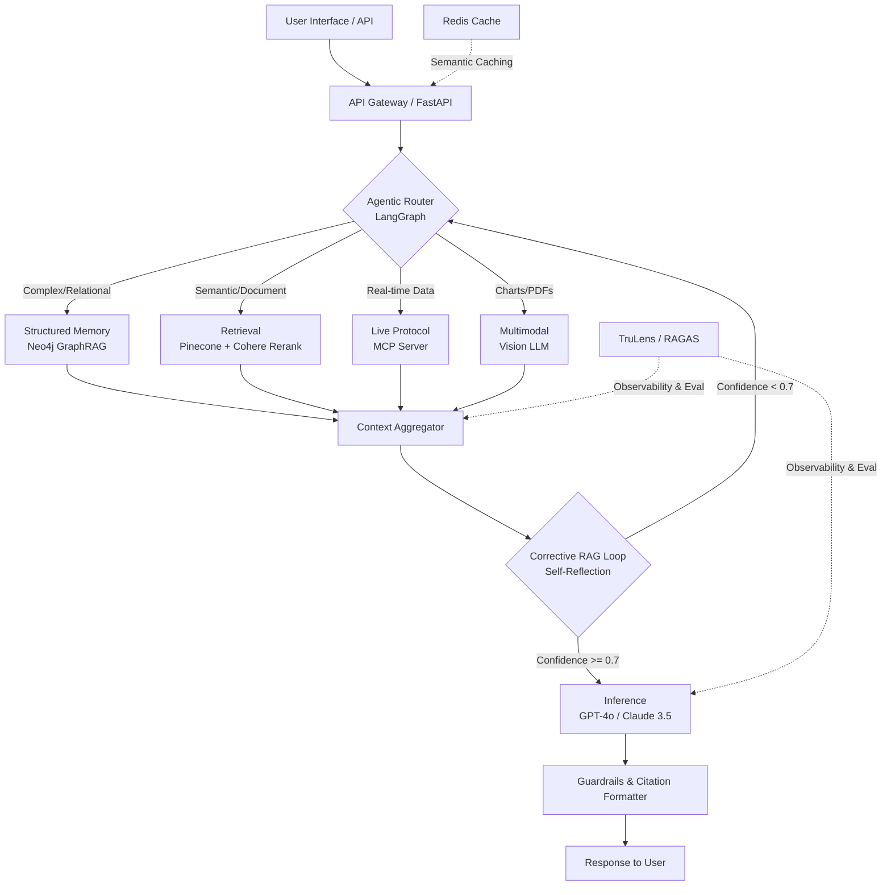

# P.R.I.S.M.

### Pipeline for Retrieval, Inference, & Structured Memory

[](https://www.python.org/)
[](https://opensource.org/licenses/MIT)
[](https://fastapi.tiangolo.com)
[](https://docs.ragas.io/)
[](https://langchain-ai.github.io/langgraph/)

**P.R.I.S.M.** is a production-grade, multimodal, agentic Retrieval-Augmented Generation (RAG) platform engineered for high-stakes financial intelligence. It integrates **Agentic Routing**, **GraphRAG (Structured Memory)**, **Corrective RAG (CRAG)**, and **Model Context Protocol (MCP)** to deliver autonomous, self-correcting, and real-time market insights.

---

## Core Architectural Pillars

- **Agentic Orchestration (LangGraph):** Dynamically decomposes complex queries and routes them to the optimal retrieval modality.
- **Structured Memory (GraphRAG):** Neo4j-powered knowledge graph enabling multi-hop reasoning across company relationships and executive backgrounds.
- **Truthful Inference (Corrective RAG):** A self-reflective verification loop that scores retrieval confidence and autonomously triggers re-retrieval when confidence < 0.7.
- **Multimodal Extraction:** Native parsing of complex financial charts, tabular data, and earnings call transcripts using Vision LLMs.
- **Live Protocol Integration (MCP):** Custom Model Context Protocol servers connecting to live financial APIs for real-time metric validation.
- **Production Observability:** Continuous, automated evaluation via RAGAS and TruLens.

---

## System Architecture



---

## Tech Stack

| Layer | Technology | Purpose |
|-------|------------|---------|
| Orchestration | LangGraph | Stateful, cyclical agentic workflows |
| Vector Database | Pinecone | Managed, low-latency hybrid search |
| Structured Memory | Neo4j | Knowledge graph for multi-hop reasoning |
| Embeddings / Rerank | Cohere Embed v3 & Rerank v3 | Top-tier retrieval precision |
| LLM Inference | GPT-4o / Claude 3.5 Sonnet | Reasoning, tool-calling, multimodal |
| Backend | FastAPI (Python 3.11) | High-performance async API |
| Caching | Redis | Semantic cache for cost reduction |
| Evaluation | RAGAS + TruLens | Quantifiable AI observability |
| Infrastructure | Docker, Kubernetes (GCP) | Production-grade deployment |

---

## Quick Start

```bash
git clone https://github.com/yourusername/prism-ai.git
cd prism-ai

cp .env.example .env
# Edit .env with your API keys

docker-compose up --build
```

API documentation available at `http://localhost:8000/docs`.

---

## Project Structure

```
├── src/
│   ├── main.py              # FastAPI entry point
│   ├── config.py            # Environment configuration
│   ├── api/                 # REST API routes & models
│   ├── ingestion/           # Document chunking, embedding, Pinecone ingest
│   ├── retrieval/           # Vector search & Cohere reranking
│   ├── agents/              # LangGraph agentic orchestration
│   ├── graph/               # Neo4j GraphRAG integration
│   ├── mcp_servers/         # Model Context Protocol servers
│   ├── multimodal/          # Vision LLM integration
│   ├── evaluation/          # RAGAS / TruLens evaluation
│   └── utils/               # Logging, exceptions, helpers
├── docs/                    # Architecture & setup documentation
├── tests/                   # Test suite
├── docker-compose.yml
├── Dockerfile
└── pyproject.toml
```

---

## V1.0 Target Metrics

| Metric | Target |
|--------|--------|
| RAGAS Faithfulness | > 0.90 |
| RAGAS Context Precision | > 0.85 |
| Hallucination Rate | < 5% |
| P95 Latency | < 2.5s |
| Cost per Query | < $0.015 |

---

## License

MIT License. See [LICENSE](LICENSE) for details.

---

*Built to demonstrate the next generation of enterprise AI systems. For detailed documentation, see `/docs/`.*
